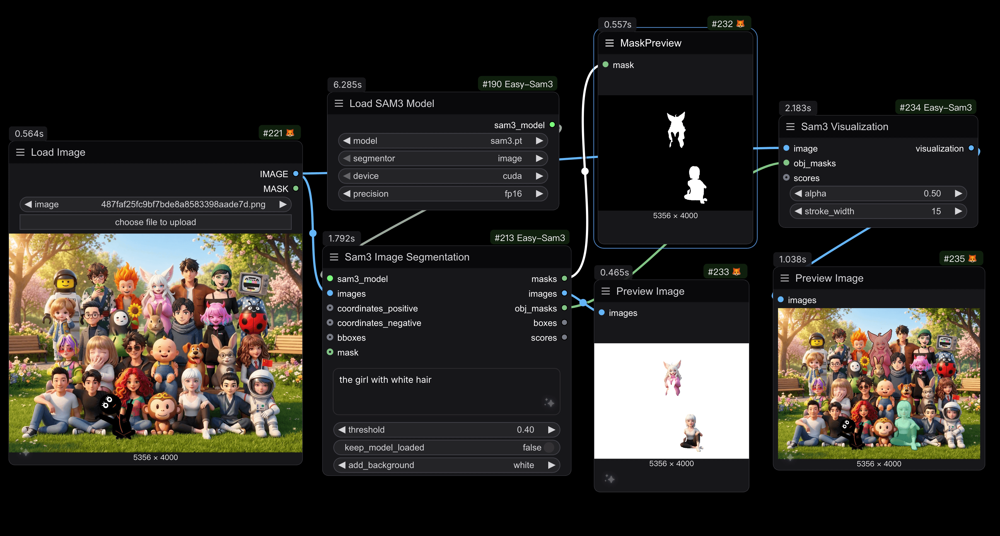
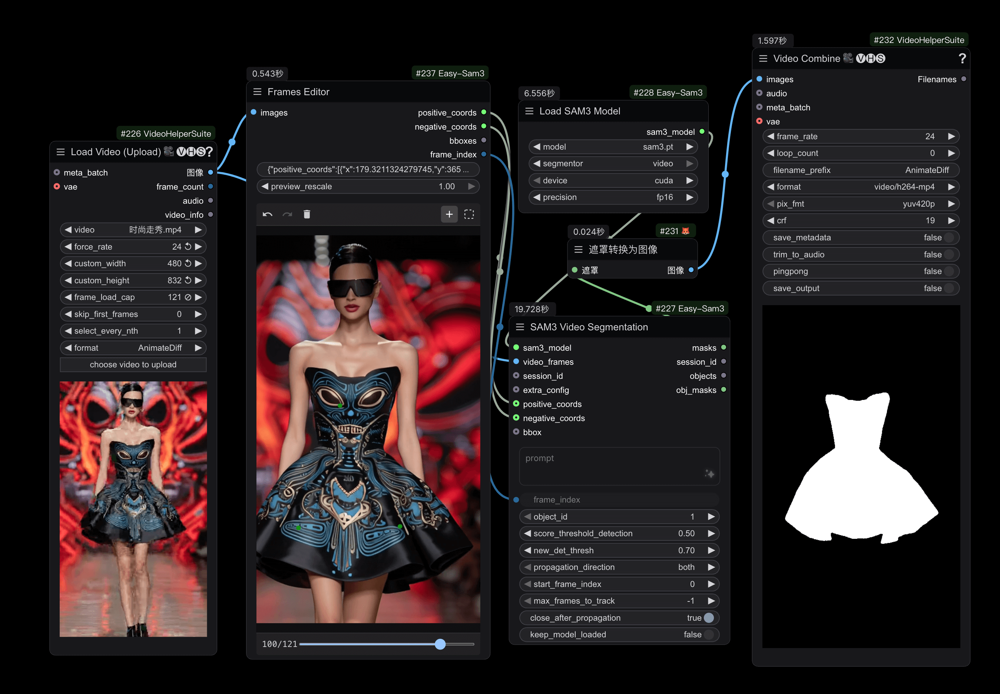

# ComfyUI-Easy-Sam3

[English](README.md) | [中文](README_CN.md)

A ComfyUI custom node package for [SAM3 (Segment Anything Model 3)](https://github.com/facebookresearch/sam3), providing powerful image and video segmentation capabilities with text prompts.

## Overview

This node package brings Meta's SAM3 model to ComfyUI, enabling:
- **Image Segmentation**: Segment objects in images using text descriptions
- **Video Tracking**: Track and segment objects across video frames
- **Advanced Configuration**: Fine-tune video tracking parameters for optimal results
- **Frames Editor**: Interactive visual editor for creating point and bounding box prompts on images and video frames

### Image Segmentation

*Example of semantic segmentation on images*

### Video Segmentation

*Example of points coordinates segmentation on video frames*

## Features

- 🖼️ **Image Segmentation**: Segment objects using natural language prompts
- �️ **Multi-Category Segmentation**: Support for comma-separated prompts to segment different object categories in a single image (e.g., "cat, dog, person")
- �🎬 **Video Segmentation**: Track objects across video frames with consistent IDs
- 🎨 **Background Options**: Add custom backgrounds (black, white, grey) to segmented images
- ⚙️ **Flexible Configuration**: Support for different devices (CUDA, CPU, MPS) and precisions (fp32, fp16, bf16)
- 🔧 **Advanced Controls**: Comprehensive video tracking parameters for fine-tuning

## Nodes

### 1. Load SAM3 Model
Load a SAM3 model for image or video segmentation.

**Inputs:**
- `model`: SAM3 model file from the models/sam3 folder
- `segmentor`: Choose between "image" or "video" mode
- `device`: Device to load the model on (cuda, cpu, mps)
- `precision`: Model precision (fp32, fp16, bf16)

**Outputs:**
- `sam3_model`: Loaded SAM3 model for downstream nodes

## Model Downloads

Download SAM3 model weights from the repository:
- [SAM3 Models](https://huggingface.co/facebook/sam3)
- [SAM3 FP16 Model](https://huggingface.co/yolain/sam3-safetensors/blob/main/sam3-fp16.safetensors)

Place the downloaded models in: `ComfyUI/models/sam3/`

## Requirements

- Python 3.8+
- PyTorch 2.0+
- ComfyUI
- CUDA-compatible GPU (recommended)

## Localization

This node package supports multiple languages:
- English (`locales/en/nodeDefs.json`)
- Chinese (`locales/zh/nodeDefs.json`)

## Credits

- **SAM3**：[Facebook Research](https://github.com/facebookresearch/sam3)
- **ComfyUI**：[comfyanonymous](https://github.com/comfyanonymous/ComfyUI)
- **ComfyUI-segment-anything-2** ：[ComfyUI-segment-anything-2](https://github.com/kijai/ComfyUI-segment-anything-2)
- **ComfyUI-KJNodes** ：[ComfyUI-KJNodes](https://github.com/kijai/ComfyUI-KJNodes)
- **ComfyUI-Sam3**: [ComfyUI-SAM3](https://github.com/PozzettiAndrea/ComfyUI-SAM3)

### 南光AIGC

南光AIGC-AIGC全能方案设计解决专家 VX:nankodesign2001

南光AIGC绘画 仙宫云新人注册网址---https://www.xiangongyun.com/register/MJAT43 新人注册仙宫云送5元代金券， 填写邀请码（输入我们的邀请码：MJAT43 ）还额外送3元代金券 完成后可以得到仙宫云8元账户余额，可以免费带你玩转5小时发高配4090 D显卡AIGC绘画。

PS软件（AI）插件
https://istarry.com.cn/?sfrom=jbEHmC
提供多种强大的AI功能，轻松提升设计效率，邀您免费体验

通过这个链接注册送1000RH币：https://pre.runninghub.cn/?inviteCode=t7ztfeiw 注册领1000RH币可以免费生成好多图片视频哦！

### 三大自媒体平台

小红书
https://www.xiaohongshu.com/user/profile/5fe63b41000000000100811d?m_source=itab

抖音
https://www.douyin.com/user/self?showTab=post

bilibili（B站）
https://space.bilibili.com/404783526

### 如果您受益于本项目，不妨请作者喝杯咖啡，您的支持是我最大的动力

    
    

# 商务合作
如果您有定制工作流/节点的需求，或者想要学习插件制作的相关课程，请联系我
wechat:nankodesign2001
